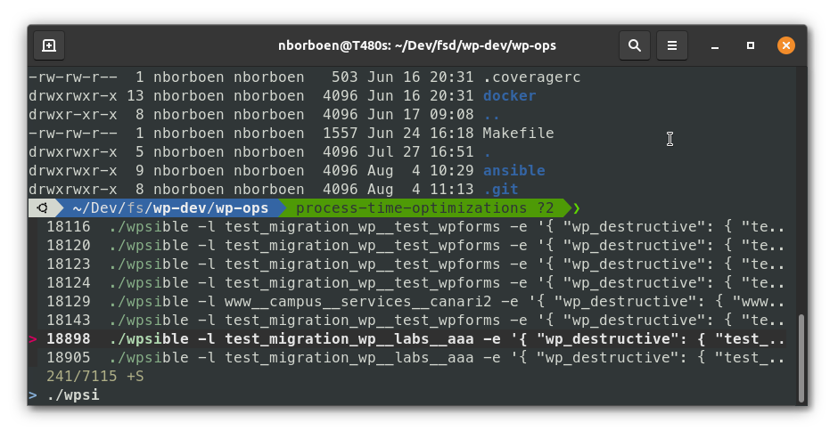
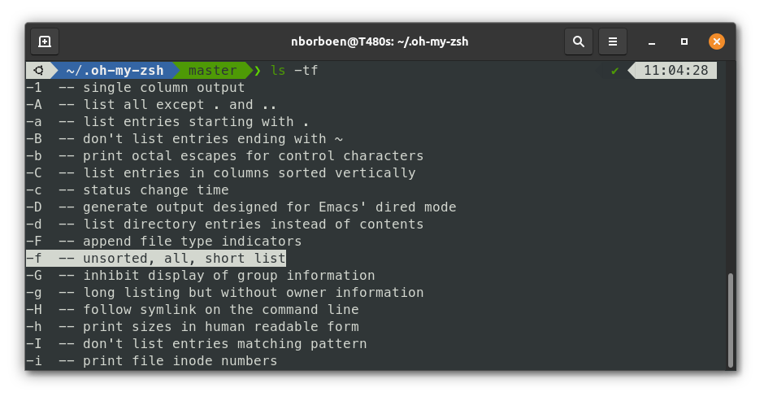
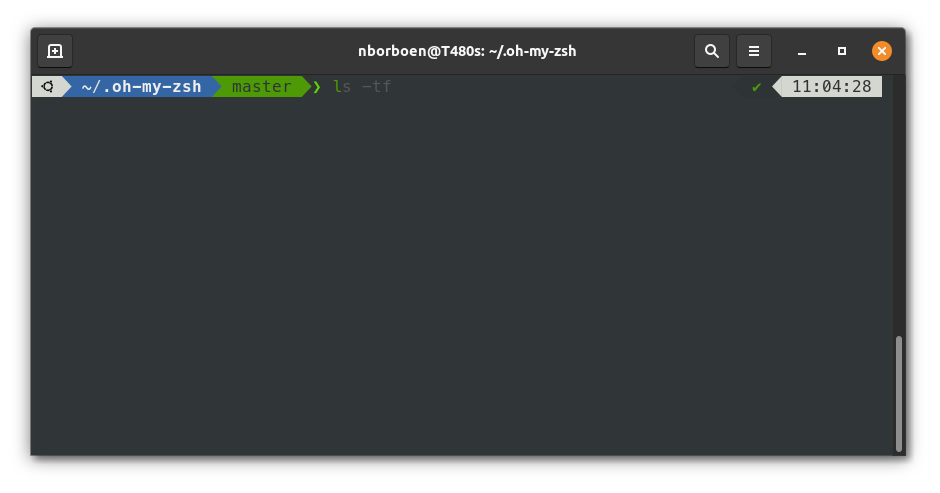
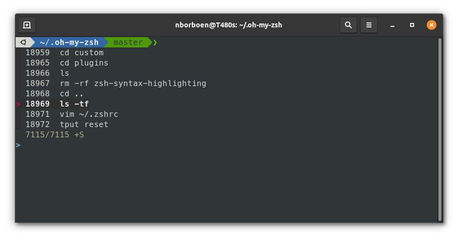

# My Terminal

This is my reminder for configuring my terminal with [Zsh](https://www.zsh.org/).



## Oh My Zsh

[https://ohmyz.sh/](https://ohmyz.sh/)

```bash
sh -c "$(wget https://raw.github.com/ohmyzsh/ohmyzsh/master/tools/install.sh -O -)"
```

## Zsh config

### History

~/.zshrc
```bash
# User configuration
HISTFILE=~/.zsh_history
HISTSIZE=999999999
SAVEHIST=$HISTSIZE
setopt inc_append_history
setopt share_history
```

### Aliases

Zsh comes with a ton of alias, just type `alias` in your termial to study them.

If you want to use your own aliases, use your `~/.bash_aliases` in order to be
able to use them in any shells.

~/.zshrc
```bash
source ~/.bash_aliases
```

### Plugins
~/.zshrc
```bash
plugins=(
        git
        docker
        oc
        kubectl
        npm
        node
        wp-cli
        zsh-autosuggestions
        zsh-syntax-highlighting
        )
```

Have a look to [https://github.com/ohmyzsh/ohmyzsh/wiki/Plugins](https://github.com/ohmyzsh/ohmyzsh/wiki/Plugins) to find more!



### zsh-autosuggestions

[https://github.com/zsh-users/zsh-autosuggestions](https://github.com/zsh-users/zsh-autosuggestions)
```bash
git clone https://github.com/zsh-users/zsh-autosuggestions ${ZSH_CUSTOM:-~/.oh-my-zsh/custom}/plugins/zsh-autosuggestions
```



### zsh-syntax-highlighting

[https://github.com/zsh-users/zsh-syntax-highlighting](https://github.com/zsh-users/zsh-syntax-highlighting)
```bash
git clone https://github.com/zsh-users/zsh-syntax-highlighting.git ${ZSH_CUSTOM:-~/.oh-my-zsh/custom}/plugins/zsh-syntax-highlighting
```

## Zsh theme

[https://github.com/romkatv/powerlevel10k](https://github.com/romkatv/powerlevel10k)

```bash
git clone --depth=1 https://github.com/romkatv/powerlevel10k.git ${ZSH_CUSTOM:-$HOME/.oh-my-zsh/custom}/themes/powerlevel10k
p10k configure
```

### Zsh P10K Theme configuration

~/.zshrc
```bash
ZSH_THEME="powerlevel10k/powerlevel10k"
POWERLEVEL9K_LEFT_PROMPT_ELEMENTS+=(dir vsc)
POWERLEVEL9K_RIGHT_PROMPT_ELEMENTS+=(node_version php_version ram cpu_temp)
```

## FZF

[https://github.com/junegunn/fzf](https://github.com/junegunn/fzf)
```bash
git clone --depth 1 https://github.com/junegunn/fzf.git ~/.fzf
~/.fzf/install
```




[//]: pandoc \
  --variable mainfont="DejaVu Sans" \
  --variable monofont="DejaVu Sans Mono" \
  --variable fontsize=11pt \
  --variable geometry:"top=1.5cm, bottom=2.5cm, left=1.5cm, right=1.5cm" \
  --variable geometry:a4paper \
  --variable colorlinks \
  --variable linkcolor=blue \
  --variable urlcolor=blue \
  --table-of-contents \
  --number-sections \
  --highlight-style tango \
  -f markdown README.md \
  --pdf-engine=lualatex \
  -o MyTerminal.pdf && xdg-open MyTerminal.pdf
